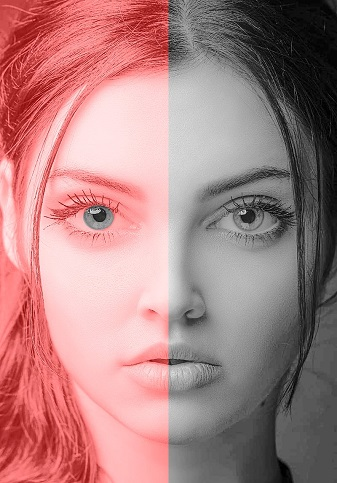

# sorceress 1.5

[](https://app.travis-ci.com/altunenes/sorceress) [](https://badge.fury.io/py/sorceress) [](https://github.com/altunenes/sorceress/actions/workflows/jekyll.yml)
[](https://pypistats.org/packages/sorceress)


Install with pip

```
pip install sorceress==1.5
```

```
#importing
import sorceress
#another way to import 
from sorceress import sorcerer
```

**sorceress** is a python package for creating optical illusions in an easy way.

👀️ And It will get update periodically as soon as I create space. 👀️

## Functions:

1- chromatic() 2- dotill() 3- realtimegrid() 4- addlines()  17-footsteps(javascript)

5-addlinesAlpha() 6- eyecolour() 7-dakinPex() 8-bruno()

9-dolboeuf() 10-kanizsa() 11-ponzol() 12-tAki2001()

13-cafewall 14-ccob 15-ebbinghaus() 16-whiteill()

## 1- sorceress.sorcerer.chromatic

Chromatic adaptation probably one of the central concept in color vision. Spatially or temporally related surrounds can have profound effects on the color appearance of illuminated objects.
According to APA, chromatic adaptation is decreased sensitivity to a particular color as a result of prolonged exposure to a colored stimulus.

With this code,you could generate your own illusion either with Von Kries or CMCCAT2000.

```
sorceress.sorcerer.chromatic("yourimage.jpg","outputname",circle=True,method="CMCCAT2000",gif=False,duration=10000)

```

```"yourimage.jpg"``` = Source image.

```"outputname" ```  = Your output name (You don't need to add extention (jpg,png etc.)

```circle=True``` = Adds a red dot in the middle of pic.

if ```gif= True ```, it will create a gif with output images (recomended). There will be 2 different types of gif. One is with the PIL library other is the from the imageio library.

```method``` you may either use Von Kries chromatic adaptation or Fairchild (1990)

simple example:

focus on the red dot (10 second)


_[image source](https://extension.unh.edu/blog/fall-good-time-plant-trees-and-shrubs)_

## 2- sorceress.sorcerer.dotill()


Lateral inhibition is the phenomenon in which a neuron's response to a stimulus is inhibited by the excitation of a neighboring neuron (Bakshi and Ghosh, 2017).Neurons that are firing inhibit the stimulation of surrounding. Accordingly, only the neurons that are most stimulated and least inhibited respond (Cohen, 2011).

It's an old-fashioned illusion that is probably known the most.

```
dotill(hsize,wsize,hlinefreq=12,wlinefreq=12,dotcolor=(0,255,0),dotradius=5,horizontalcolor=(14, 75, 3),verticalcolor=(14, 75, 3),horizontalthickness=4,verticalthickness=4,verticallines=True,horizontallines=True):
```

`hsize` and `wsize` are dimensions of the image. `Hlinefreq` is the frequency of vertical lines and the `wlinefreq` is for the horizontal lines. `dotcolor` is the color of the dots. `dotradius` is the radius of the circles. `horizontalcolor` and `verticalcolor` points the colors of the lines. You may remove those lines with` verticallines=False,horizontallines=False`

example usage:

```
sorceress.sorcerer.dotill(500,500)
```

## 3- sorceress.sorcerer.realtimegrid()

```
sorceress.sorcerer.realtimegrid(realcolours=True)
```


perceive black and white real time (with webcam) frames as colorful.

with `realcolours=False` code will not calculate the real colors of your frame. I recommend you to use this function with real colors. Illusion is getting powerful if colors of lines separate each other, however,  with `realcolours=False` means a lot of options are needed in the slide bar and it's not a pleasant view. It is an indicator of how flexible the color perception in the human visual system is.  [Inspiration](https://www.patreon.com/posts/color-grid-28734535):

## 4- sorceress.sorcerer.addlines

inspired from Akiyoshi Kitaoka.

Have you seen this illusion before? In bellow, someone is hiding after those grids. *Beneath this *grids there* is *more than* Grids. Beneath this *grids there* is an idea. And ideas are bulletproof...*


```
sorceress.sorcerer.addlines(img,outputname,linecolour1=(0,255,0),linecolour2=(0,255,255),linecolour3=(255,0,0))

```

Add vertical lines to an image

`img` your input image like `"morgo.jpg"`
`outputname` desired output like `desired`
`linecolour1` `linecolour2` and `linecolour3` are point the colors of lines.
example usage:
`sorceress.sorcerer.addlines("vfor.jpg","mygrids",linecolour1=(150,5,5),linecolour2=(10,155,20),linecolour3=(0,15,15)) `

## 5- sorceress.sorcerer.addlinesAlpha

Same with "addlines" but this time; line colors are much more stable against the luminance change in the background image. It's because in opencv, when you overlay two images or colors the function called `addWeighted` mixes the colors in very "small tones" but you probably do not even notice. Still, this function which I called alpha blending, is much more stable to luminance change. Use both, in the same way and see what is differs.

```
addlinesAlpha(self,img,outputname,linecolour1=(0,255,0),linecolour2=(0,255,255),linecolour3=(255,0,0)
```

## 6- sorceress.sorcerer.eyecolour

[inspried from:](https://michaelbach.de/ot/col-context/index.html)

```
sorceress.sorcerer.eyecolour("yourimage.jpg")

```

With this illusion, you perceive the black and white NumPy array as colorful. After you run this code, you need to select the iris manually then push the enter. I didn't want to use the iris detector since it slowing down the script. Just select smaller as much as possible. I've used `seamlessClone` function from the OpenCV for getting much more realistic results. Your ROI (region of interest that you selected manually) will correspond an eclipse' coordinates which I needed to detect the exact position of the iris.

example: You probably have seen this lady's left eye as blue, but it's exactly the same color as the right eye.



## 7- sorceress.sorcerer.dakinPexc

```
sorceress.sorcerer.dakinPex(outputname="myoutput",dimension=800)
```


If you see the different tones of gray this illusion is successful. If you perceiving all same, try with the big dimensions.

I've written this illusion after the read a paper from (Dakin and Bex, 2003).The existence of spatial frequency channels in the visual system is implicated in lightness perception. And I also should note that It has long been known that the brightness of a region of visual space is not related only to that region’s luminance, but depends also upon the luminances of adjacent regions (Von Bekesy, 1968).

## 8- sorceress.sorcerer.bruno

```
bruno(outputname,circle=False,polycolor=(0, 255, 255), rectcolor=(255, 255, 0), circColor=(0, 0, 255))
sorceress.sorcerer.bruno("myimagee",polycolor=(0,0,255),rectcolor=(34,34,128))
```


Well in the first time it seems a little bit confusing but in their experiments, Bruno et al. (1997) have shown their participants first the shapes that you've seen on the left then shapes on the right have shown. In this experiment, participants needed to decide quickly as much as possible whether is it the same or not with the previous shape that they had shown. Results have shown that, participants were fast and found it easy to say that the two shapes were the same in the top situation. But they were very slow in the other scenario (It's still same!).

## 9- sorceress.sorcerer.dolboeuf

```

dolboeuf(outputname,circleColor=(0,0,255),kill=False)

sorceress.sorcerer.dolboeuf("doloeufout",kill=False)
```


Which red circle is bigger than the other? Probably you know what I'm talking about, two of them in the same radius. This illusion was first created by Belgian psychologist Joseph Remi Leopold Delbœuf in 1865. It's all about the perception of size. Of course, it's not the "all" about the story, the size differences of the inner and outer circle also playing their roles in this illusion... Well, I didn't create a parameter for customizing those circle's (inner and outer) radius but I believe you get the point. If you select the `kill=True`, the illusion will be destroyed by the two horizontal lines.

## 10- sorceress.sorcerer.kanizsa

```
kanizsa(outputname,dims,circleColor=(0,0,255))

sorceress.sorcerer.kanizsa("12outkaniza",400,circleColor=(34,34,178))
```


The Kanizsa illusion is probably one of the most known it was created by an Italian psychologist Gaetano Kanizsa (1913–1993). We can see surfaces, in this example squares (even though there are different kinds of Kanizas), with contours that are not present in the image. It is called illusory contours you can call this illusion also the "subjective contours" (Kanizsa, 1976). The first time I heard the name "Kanizsa" I thought he is Japanese for a long time. Then I learned that Kaniza was actually an Italian! It's because his name is used in many psychology textbooks to describe the Kanizsa triangle and most of those books don't give the full name of Kanizsa.

## 11- sorceress.sorcerer.ponzol

```
ponzol(outputname,kill=False,line1=(255,0,0),line2=(255,0,0),rectangle1=(0,0,255),rectangle2=(0,0,255))

sorceress.sorcerer.ponzol("test",kill=False,line1=(0,0,139),line2=(0,0,139),rectangle1=(0,69,255),rectangle2=(0,80,255))
```


The Ponzo illusion is old (Ponzo, 1912). But Ponzo actually published his illusion with a scientific paper. Actually, any image with a strong sense of perspective has this. You could see various methods if you search a little bit (especially in railways).

## 12- sorceress.sorcerer.tAki2001

```
tAki2001(self,outputname, dimension=700, circlecolour=(0, 255, 255), circleradius=15, bglinecolor=(255, 128, 128),bgcolor=(255, 255, 255))
```

```
#example usage:
sorceress.sorcerer.tAki2001("YelowRay",dimension=1200)

```


“Coloured ray illusion ” by Akiyoshi Kitaoka (Kitaoka, 2001). There were similar kinds of illusions that have been described by other scientists like Prandtl,(1927). Illusory yellow circles appear to run obliquely over the homogeneously white background. I added to function to change the background in the BGR array. Try it with other background colors with `bgcolor` parameter.

## 13-sorceress.sorcerer.cafewall

```
cafeWall(outputname, dimension=1200, resize=False, brickcolor=(255, 255, 255), bgcolor=(0, 0, 0))
```

```
#example:
sorceress.sorcerer.cafeWall("myimage",1200,resize=True,brickcolor=(0,0,128),bgcolor=(114,128,254))

```


This is maybe one of the most strong optical illusions that have ever been created. Bricks create a pattern in which the mortar lines between them do not look parallel. Why do we call it a "cafe wall"? well, a student of Richard Gregory from the University of Bristol has noticed this from a café (on St Michael’s Hill). The illusion is strongest when the mortar has a brightness that is in between that of the two tiles. So illusion will be work as long as colors have different brightness.

Why we are seeing this? Well, the only scientific explanation that I've known is from Gregory and Heard (1979). The role of orientation-sensitive simple cells in V1 and reactions to luminance borders are mainly involved in this illusion as they've mentioned. Gregory and Heard (1979) proposed that regions of varying luminances be retained in the spatial register by locking their borders. This border-locking technique causes inadvertent contour alterations between sections separated by small gaps. They've also shown that illusion disappears if the luminance of the middle line is noticeably lower or higher than the luminance of the two types of squares.

## 14-sorceress.sorcerer.ccob

```
ccob(self,image, rms=0.5, amplitudespectrum=300, plttitle='output')
```

```
#usage
sorceress.sorcerer.ccob("aki.jpg",rms=0.5,amplitudespectrum=300,plttitle="myoutput")

```


The signs with the letters R inside are the same color! This one is probably the most math-required optical illusion in this package. 😄 First why do I call it "ccob" it stands for "Craik–Cornsweet–O'Brien" and is commonly called as CCOB effect. The illusion is the same `sorceress.sorcerer.dakinPexc()`. This illusion is taken as evidence for a low–level ‘filling–in’ mechanism subserving lightness perception. How do I create this illusion? Well, it's about the spatial frequency filtering with Fourier transform. And this illusion is mostly stimulus-oriented, so be sure your input image has some big luminance differences and does not have too much roughness. The function is converting your image to grayscale first then scaling to -1 +1. Then RMS which is the standard deviation of a measure of image contrast, also known as “root means square”, the contrast has been adjusting. The most important part is the amplitude spectrum. You can either apply a low or high pass filter it depends on your input image. Finally, to minimize coarse changes in luminance, the function applies a Laplacian-of-Gaussians (LoG) filter. If you look close enough to the edges of the domains you may see some "ringing". This is the result of the discrete Fourier transform.

The image that've shown image has been taken from the A. Kitaoka's twitter account. Here, I would like to show another example with another input image:

```
sorceress.sorcerer.ccob("kaniza.png",rms=0.2,amplitudespectrum=300,plttitle="myoutput2")

```


Above the color of the circles and the surface is the same. Try yourself with different amplitude spectrum and RMS values.

## 15-sorceress.sorcerer.ebbinghaus

```
ebbinghaus(output, bgcolor=(255, 255, 255), lcradius=22, rcradius=22, lcradius2=25, rcradius2=45)
```

```
sorceress.sorcerer.ebbinghaus("output",bgcolor=(0,255,255),lcradius=22,rcradius=22)

```


It looks simple, but the creating process of this illusion is about trigonometry 😄. The illusion called Ebbinghaus Illusion is similar to the Delbœuf illusion. In both illusions, the size of an object is affected by the surrounding context. As you can see at the above bot circles has 22 radius. You also can change the outer circles' radius.

If you have psychology major like me you probably heard a lot the German psychologist Hermann Ebbinghaus, especially in the introduction courses. We know his popular work about the memory.

The illusion is widely replicated in psychology literature with different contexts (Aglioti et al, 1995; Lee and van Donkelaar, 2002; Culham et al, 2003). For example, In Aglioti's study, the direct comparison led to an approximately 50% increase of the illusion, which corresponds well to the difference found between perception and grasping.  These researchers replaced the inner circular image with a tiny poker-chip-like token in their research. When asked to estimate the size of the target tokens, the subjects displayed the illusion throughout the trial, but when asked to manually pick up the central target token, the illusion had a considerably less impact on manual grip size during the grasping process. This was seen to indicate that the ventral system is influenced by the illusion and the dorsal system is not. The findings have been replicated by Haffenden and Goodale (1998).

## 16-sorceress.sorcerer.whiteill

```
whiteill(dimension=300, version2=False, rect1=(255, 255, 255), rect2=(0, 0, 0), bgrec1=(128, 128, 128),
                 bgrec2=(128, 128, 128), bg1=(0, 0, 0), bg2=(255, 255, 255), outputname="output"):
```

```
sorceress.sorcerer.whiteill(dimension=300,version2=False,rect1=(92,92,255),rect2=(47,255,173),outputname="whiteillout")
```


This is another strong illusion that has been described by White (1979). As you can see above, although the inner rectangles have in same gray ((128,128,128)) scale we perceive it in different contrast. It is hard to believe that two grey patches are the same when they look so different. You may also perceive the "lighter one" as larger but it's another part of the illusion which was described first by Galileo Galilei (1632) as the "irradiation effect". This function has also different various of this illusion you may call with the `version2=True` that shown like the bellow:

```
sorceress.sorcerer.whiteill(version2=True,outputname="whiteillout")
```


Do I need to say grays are the same? 😄. The scientific explanations are still debated in the literature at first look. A recent study about White's study (Betz et al (2015)) found that the illusion was marginally enhanced by contour adaptation at the test patch edges parallel to the grating. The contrasting behavior seen in the current investigation in response to independent manipulations of collinear or flanking bar luminance is consistent with these findings.


## 17-sorceress footsteps


Ok since this is not part of the our python package I have not listed it in the function. First of all, you can access thisi illusion from here and you can access the source codes from this repo.
[sorceress/footsteps:]( https://altunenes.github.io/sorceress/footsteps)

The footsteps illusion is a motion illusion in which objects appear to move fast or slow even when they move at the same speed. With the link that I share with you above you can the speed and the adjusted colors in the same. In this version, I've added a small red rectangle in the middle. After you adjust colors in the same range (choose colors that have high contrast!) and slow down the animation speed focus to the middle rectangle now it looks like moving back and forth.

The key point of explanation of this illusion is the brightness differences. Between the moving objects and the background is important for the explanation of this illusion (Anstis, 2003).

### REFERENCES

Aglioti S, DeSouza JFX, Goodale MA (1995) Size-contrast illusions deceive the eye but not the hand. Curr Biol 5:679–685

Anstis S. Moving objects appear to slow down at low contrasts. Neural Netw. 2003 Jun-Jul;16(5-6):933-8. doi: 10.1016/S0893-6080(03)00111-4. PMID: 12850053.


Bakshi, A., & Ghosh, K. (2017). A Neural Model of Attention and Feedback for Computing Perceived Brightness in Vision. Handbook of Neural Computation, 487–513. doi:10.1016/b978-0-12-811318-9.00026-0

Bruno N, Bertamini M, Domini F (1997) Amodal completion of partly occluded surfaces: Is there a mosaic stage. J Exp Psychol Hum Percept Perform 23:1412–1426

Cohen R.A. (2011) Lateral Inhibition. In: Kreutzer J.S., DeLuca J., Caplan B. (eds) Encyclopedia of Clinical Neuropsychology. Springer, New York, NY. https://doi.org/10.1007/978-0-387-79948-3_1379

Culham, J.C., Danckert, S.L., Souza, J.F.X.D. *et al.* Visually guided grasping produces fMRI activation in dorsal but not ventral stream brain areas. *Exp Brain Res* **153, **180–189 (2003). https://doi.org/10.1007/s00221-003-1591-5

Dakin S. C. and Bex P. J. 2003 Natural image statistics mediate brightness ‘filling in’**Proc. R. Soc. Lond. B.**270**2341–2348 http://doi.org/10.1098/rspb.2003.2528

Gregory RL, Heard P (1979) Border locking and the café wall illusion. Perception 8(4):365–380

Haffenden, A. M. & Goodale, M. A. (1998) The effect of pictorial illusion on prehension and perception. Journal of Cognitive Neuroscience 10(1):122–36

Kanizsa G (1976) Subjective contours. Sci Am 234:48–52

Kitaoka, A. (2001).　Illusion designology (7): Illusory light perception that cannot be explained by the Fourier analysis. *Nikkei Science,*  **31** (8), 66-68 (in Japanese).

Lee, JH., van Donkelaar, P. Dorsal and ventral visual stream contributions to perception-action interactions during pointing. *Exp Brain Res* **143, **440–446 (2002). https://doi.org/10.1007/s00221-002-1011-2

Ponzo, M. (1911). "Intorno ad alcune illusioni nel campo delle sensazioni tattili sull'illusione di Aristotele e fenomeni analoghi".

Prandtl A (1927) Über gleichsinnige Induktion und die Lichtverteilung in gitterartigen Mustern [Onuniform induction and light distribution in lattice patterns]. Zeitschrift für Sinnesphysiologie58:263–307

Torsten Betz, Robert Shapley, Felix A. Wichmann, Marianne Maertens; Testing the role of luminance edges in White's illusion with contour adaptation. *Journal of Vision* 2015;15(11):14. doi:10.1167/15.11.14.

White M (1979) A new effect of pattern on perceived lightness. Perception 8:413–416

Von Bekesy G. (1968) Mach- and Hering-type inhibition invision. Vision Res. 8, 1483-1499.
