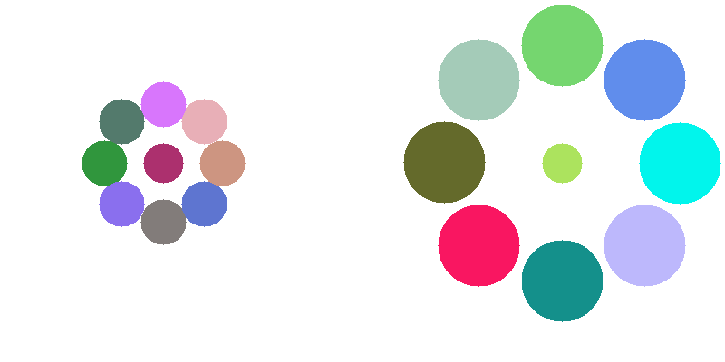

## This page is trying to explain all optical illusions

First, let's import the package. I usually import the package like this:

`from sorceress import sorceress`

### Dependencies

To use the code in this tutorial, you need to install several packages. This can be done by typing the following commands in your terminal:
``` python

pip install numpy
pip install matplotlib
pip install opencv-python
pip install imageio
pip install pillow
pip install color-science
```
If you are using conda, you can install the packages by replacing pip install with conda install. If you are using pipenv, you can install the packages by replacing pip install with pipenv install

You don't need to import the other packages, because they are imported in the sorceress package.

## 1- chromatic

Chromatic adaptation is a central concept in color vision that is important for the perception of color. When the color of the light source changes, the brain automatically compensates for this change, which can alter the way that colors are perceived in an image. For example, if you look at an optical illusion under different lighting conditions, it may appear to change in intensity or color due to the brain's ability to adapt to changes in the color of the light. Chromatic adaptation is a decreased sensitivity to a particular color as a result of prolonged exposure to a colored stimulus.

The chromatic adaptation transforms were studied with von Kries, Bradford, Sharp, and CMCCAT2000. However, CMCCAT2000 performed best. This function can be applied to any image and automatically processes the image, returning a gif file showing the transformation of the image from the original to the adapted image.

The von Kries chromatic adaptation method is a technique used in camera image processing. It applies a gain to each of the human cone cell spectral sensitivity responses in order to keep the adapted appearance of the reference white constant. Herbert E. Ives was the first to apply Johannes von Kries' theory of adaptive gains on the three cone cell types to the issue of color constancy. As a result, the technique is sometimes known as the Ives transform or the von Kries-Ives adaptation (Gegenfurtner, 1999).

```
sorceress.chromatic("inputfolder/tree.jpg",Gifduration=10)
```

simple example via a gif:

focus on the red dot (10 second)


_[image source](https://extension.unh.edu/blog/fall-good-time-plant-trees-and-shrubs)_

## 2- dotill


Lateral inhibition is a phenomenon in which a neuron's response to a stimulus is inhibited by the excitation of a neighboring neuron (Bakshi and Ghosh, 2017). This process occurs when neurons that are firing inhibit the stimulation of surrounding neurons, resulting in only the neurons that are most stimulated and least inhibited responding (Cohen, 2011).

During lateral inhibition, some neurons are activated more than others. Highly activated primary neurons in the brain release excitatory neurotransmitters to neurons along a specific path, as well as activate interneurons that prevent the stimulation of cells located laterally. Interneurons are nerve cells that facilitate communication between the central nervous system and motor or sensory neurons. This action enhances the contrast between different stimuli and sharpens the focus on a particular stimulus. Lateral inhibition can be observed in body sensory systems such as the olfactory, visual, tactile, and auditory systems.

This process allows for the enhanced perception of certain stimuli, such as the Mach bands, the perception of light and dark lines next to abrupt brightness changes, and the gray dots that appear between junctions in the Hermann grid illusion. These phenomena can all be explained by lateral inhibition. In addition, lateral inhibition is observed in various sensory systems, including the olfactory, visual, tactile, and auditory systems.

example usage:

```
sorceress.dotill((500,500),hlinefreq=12,wlinefreq=12,dotcolor=(0,255,0),dotradius=5,horizontalcolor=(14, 75, 3),verticalcolor=(14, 75, 3),horizontalthickness=4,verticalthickness=4,verticallines=True,horizontallines=True):
```

3- sorceress.realtimegrid()

```
sorceress.realtimegrid(realcolours=True)
```

The real-time perception of black and white frames as colorful can be achieved through the use of the `sorceress.colorgrids()` function. The use of this function with the parameter `realcolors=True` allows for the calculation of the actual colors of the frame, resulting in a more powerful illusion. However, without this parameter, a greater number of options in the slide bar are required for a visually appealing result, highlighting the flexibility of the human visual system in color perception.

[Inspiration](https://www.patreon.com/posts/color-grid-28734535):

## 4- addlines

inspired from prof Akiyoshi Kitaoka.

Have you come across this illusion before? The image below may appear to be just a grid of lines at first glance, but there is more to it than meets the eye. If you look closely, you may be able to spot the hidden figure hidden among the grids. This illusion is the result of complex neural computations and a bit of guesswork. If you focus on the details, you will notice the low spatial frequencies, but if you view the image from a distance, you will see the high spatial frequencies. In other words, the further away the image is from your eye, the more grids fall on the light-sensitive portion of your retina. Low-contrast object perception is impaired by high spatial-frequency components.

To reveal the hidden figure, try scrolling up and down the page or zooming out. Alternatively, applying a Gaussian filter can also make it more visible.


```
sorceress.addlines(img,linecolour1=(0,255,0),linecolour2=(0,255,255),linecolour3=(255,0,0))

```

This function is used to add vertical lines to an image. The lines are blended, not overlaid.

To use the function, specify the input image (`img`) and the colors of the lines (`linecolour1`, `linecolour2`, and `linecolour3`). For example:
`sorceress.addlines("vfor.jpg", linecolour1=(150, 5, 5), linecolour2=(10, 155, 20), linecolour3=(0, 15, 15))`

By default, the function uses "alpha blending" to mix the colors of the lines and the background image. This makes the resulting colors more stable against changes in the background luminance. You can turn off alpha blending by setting alphablending to False in the function call.

## 5- eyecolour

[inspried from m.bach:](https://michaelbach.de/ot/col-context/index.html)

```
eyecolour("yourimage.jpg")
#best results:
eyecolour("galadriel2.jpg",alpha=0.9,beta=0.5,M=1,luminance=1,saturation=1,colors=(0,0,255)
```

This illusion allows you to see a black and white NumPy array as colorful. To use it, simply run the code and then manually select the iris. The iris selection process is necessary because using an iris detector would slow down the script. It's important to select the smallest iris possible for the best results. The seamlessClone function from OpenCV is used to create a realistic effect. Your region of interest (the manually selected iris) will be used to detect the exact position of the iris, which is necessary for the illusion to work properly.

Red, green, and blue are three overlapping color families that are each tuned to a different type of photoreceptor in the eye. When light with different wavelengths hits these photoreceptors, they are activated and produce signals that are immediately compared to signals from surrounding areas. This comparison process continues as the signals move up through the brain's hierarchy of processing centers, where they are compared to ever-larger portions of the environment. As a result, color and brightness are always relative due to this "opponent process" of signal comparison.

I must say that this illusion is very sensitive to the brightness values of the image you will use. And you should use an image that you can center exactly.

example: You probably have seen this lady's left eye as blue, but it's exactly the same color as the right eye. Use images that have a similar face structure and brightness values (luminance). In next version, I will add a parameter to adjust the luminance of the image.


## 6- dakinPexc

```
sorceress.dakinPex(outputname="myoutput",dimension=800)
```


If you are able to perceive different shades of gray in this illusion, it is successful. If you perceive them all as the same, try using a larger image size.

I developed this illusion after reading a paper by Dakin and Bex (2003), which suggests that the existence of spatial frequency channels in the visual system plays a role in lightness perception. Additionally, it has been well established that the brightness of a region in visual space is not only dependent on its own luminance, but also on the luminance of adjacent regions (Von Bekesy, 1968).

## 7- bruno

```
bruno(outputname,circle=False,polycolor=(0, 255, 255), rectcolor=(255, 255, 0), circColor=(0, 0, 255))
sorceress.sorcerer.bruno("myimagee",polycolor=(0,0,255),rectcolor=(34,34,128))
```


In a study conducted by Bruno et al. (1997), participants were shown two sets of shapes. In the first set, the shapes were the same, while in the second set, the shapes were slightly different. Participants were asked to quickly determine whether the shapes were the same or not. The results showed that participants were able to quickly and easily identify the matching shapes in the first set, but were much slower in identifying the matching shapes in the second set.

## 8- dolboeuf

```
dolboeuf(outputname,circleColor=(0,0,255),kill=False)

sorceress.dolboeuf("doloeufout",kill=False)
```


Which red circle is bigger than the other? This illusion was first created by Belgian psychologist Joseph Remi Leopold Delbœuf in 1865. It's all about the perception of size.The Delboeuf illusion is a well-known optical illusion where two circles appear to have different sizes, even though they are the same size. This illusion is caused by the surrounding context in which the circles are presented. In this case, the size of the outer circle influences the perceived size of the inner circle. The illusion can be destroyed by adding horizontal lines to the circles, which helps the viewer accurately perceive their actual size. The Delboeuf illusion is an interesting example of how our perception can be influenced by the context in which we see things. If you select the `kill=True`, the illusion will be destroyed by the two horizontal lines.

## 9- kanizsa

```
kanizsa(outputname,dims,circleColor=(0,0,255))

sorceress.kanizsa("12outkaniza",400,circleColor=(34,34,178))
```


The Kanizsa illusion is a well-known phenomenon in psychology, first described by Italian psychologist Gaetano Kanizsa in 1976. The illusion involves the perception of illusory contours or subjective contours, where the brain perceives the presence of a shape or figure despite the absence of actual physical contours in the image. In the case of the Kanizsa squares, the brain is tricked into perceiving squares where none actually exist.

This illusion is thought to arise from the way the brain processes information about shapes and figures. When we view an image, our brains automatically attempt to organize the visual information into recognizable patterns and shapes. In the case of the Kanizsa illusion, the brain mistakenly perceives illusory contours due to its innate tendency to find order in visual stimuli. This phenomenon highlights the complex processes involved in visual perception and the inherent subjectivity of our visual experiences.

## 10- ponzol

```
ponzol(outputname,kill=False,line1=(255,0,0),line2=(255,0,0),rectangle1=(0,0,255),rectangle2=(0,0,255))

sorceress.ponzol("test",kill=False,line1=(0,0,139),line2=(0,0,139),rectangle1=(0,69,255),rectangle2=(0,80,255))
```


The Ponzo illusion, named after its creator, Italian psychologist Mario Ponzo, is a classic example of how the brain uses information about depth and perspective to perceive the surrounding environment. The illusion, first published in 1912, involves an image with a strong sense of perspective, such as a set of parallel lines converging towards a vanishing point. When presented with such an image, the brain is tricked into perceiving the lines as having different lengths, even though they are actually the same. This illusion highlights the ways in which the brain can be deceived by optical illusions and the importance of considering depth and perspective in visual perception.

## 11- tAki2001

```
sorceress.tAki2001(outputname, dimension=700, circlecolour=(0, 255, 255), circleradius=15, bglinecolor=(255, 128, 128),bgcolor=(255, 255, 255))
```

```
#example usage:
sorceress.tAki2001("YelowRay",dimension=1200)

```


The "Coloured ray illusion" by Akiyoshi Kitaoka (Kitaoka, 2001) is an optical illusion in which illusory yellow rays appear to run obliquely over a homogeneously white background. Similar illusions have been described by other scientists such as Prandtl (1927). The illusion is thought to be caused by the brain's use of depth and perspective information to perceive the world around us. The function allows for customization of the background color through the use of the `bgcolor` parameter.

## 12-cafewall

```
sorceress.cafeWall(outputname, dimension=1200, resize=False, brickcolor=(255, 255, 255), bgcolor=(0, 0, 0))
```

```
#example:
sorceress.cafeWall("myimage",1200,resize=True,brickcolor=(0,0,128),bgcolor=(114,128,254))

```


The cafe wall illusion is a well-known optical illusion in which the mortar lines between bricks appear to be slanted, even though they are actually parallel. The illusion is strongest when the mortar has a brightness that is in between that of the two tiles.

The scientific explanation for this illusion is thought to involve the role of orientation-sensitive simple cells in the primary visual cortex, as well as the brain's reactions to luminance borders. Gregory and Heard (1979) proposed that the spatial register retains regions of varying luminances by locking their borders, which inadvertently causes contour alterations between sections separated by small gaps. The illusion disappears if the luminance of the middle line is significantly different from the luminance of the two types of squares.

The cafe wall illusion was first observed by a student of Richard Gregory at the University of Bristol, who noticed it in a cafe on St Michael's Hill. It is named after the location where it was discovered

## 13-ccob

```
#usage
sorceress.ccob("aki.jpg",rms=0.5,amplitudespectrum=300,plttitle="myoutput")

```


The signs with the letters R inside are the same color 😄, despite appearing differently! This illusion, known as the Craik-Cornsweet-O'Brien (CCOB) effect, is created through the use of spatial frequency filtering with Fourier transform. It is often cited as evidence for a low-level "filling-in" mechanism involved in lightness perception. The CCOB effect is similar to the `dakinPexc()`, which is another example of the brain's ability to be tricked by optical illusions. It's about the spatial frequency filtering with Fourier transform. 

But what is spatial freuqency? 

Spatial frequency is a measure of how much detail is in an image or a pattern. Low spatial frequency means that there is not much detail in the image, and it looks blurry or fuzzy. High spatial frequency means that there is a lot of detail in the image, and it looks sharp and clear.

Imagine that you are looking at a picture of a tree. If the picture has low spatial frequency, it might look like a big green blob with no branches or leaves. This is because there is not much detail in the picture, and it is hard to see the different parts of the tree. On the other hand, if the picture has high spatial frequency, you would be able to see all of the branches and leaves on the tree, and it would look much more like a real tree.

And this illusion is mostly stimulus-oriented, so be sure your input image has some big luminance differences and does not have too much roughness. In this function, the input image is first converted to grayscale and then scaled to a range of -1 to +1. The root mean square (RMS) contrast is then adjusted to create the illusion. A discrete Fourier transform is applied to the image, followed by a low or high pass filter depending on the input image. 

Discrete Fourier transform (DFT) is a mathematical operation that is used to convert the input image from the spatial domain (i.e. its original representation in terms of pixels) to the frequency domain (i.e. a representation of the image in terms of its spatial frequencies). This is done because the spatial frequencies of an image are closely related to its contrast and luminance, which are the visual features that are being manipulated in order to create the illusion.

Once the input image has been transformed into the frequency domain, a low or high pass filter can be applied to remove or enhance certain spatial frequencies in the image. This technique can result in some "ringing" around the edges of the domains, which can be seen when looking closely at the image.

Finally, a Laplacian-of-Gaussians (LoG) filter is applied to minimize coarse changes in luminance. 
The image that've shown image has been taken from the A. Kitaoka's twitter account. Here, I would like to show another example with another input image:

```
sorceress.ccob("kaniza.png",rms=0.2,amplitudespectrum=300,plttitle="myoutput2")

```


Above the color of the circles and the surface is the same. Try yourself with different amplitude spectrum and RMS values.

## 14-ebbinghaus

```
sorceress.ebbinghaus("output",bgcolor=(0,255,255),lcradius=22,rcradius=22)

```



The Ebbinghaus illusion, also known as the Titchener circles, is an optical illusion that demonstrates how the size of an object can be affected by its surrounding context. In this illusion, two circles with the same radius appear to be different sizes due to the influence of the surrounding circles. This illusion was first discovered by German psychologist Hermann Ebbinghaus and is widely studied in psychology literature. 

Studies have shown that the Ebbinghaus illusion can have a strong impact on size perception, but has little effect on manual grasping. This suggests that the ventral system, which is involved in perception, is influenced by the illusion, while the dorsal system, which is involved in motor control, is not.

The exact mechanisms behind the Ebbinghaus illusion are not fully understood, but it is thought to be related to the brain's ability to interpret spatial relationships and depth cues. The illusion is often used as a tool for studying visual perception and the brain's ability to process visual information.

The illusion is widely replicated in psychology literature with different contexts (Aglioti et al, 1995; Lee and van Donkelaar, 2002; Culham et al, 2003). For example, In Aglioti's study, the direct comparison led to an approximately 50% increase of the illusion, which corresponds well to the difference found between perception and grasping.  These researchers replaced the inner circular image with a tiny poker-chip-like token in their research. When asked to estimate the size of the target tokens, the subjects displayed the illusion throughout the trial, but when asked to manually pick up the central target token, the illusion had a considerably less impact on manual grip size during the grasping process. This was seen to indicate that the ventral system is influenced by the illusion and the dorsal system is not. The findings have been replicated by Haffenden and Goodale (1998).

## 15-whiteill

```
sorceress.whiteill(dimension=300,version2=False,rect1=(92,92,255),rect2=(47,255,173),outputname="whiteillout")
```


he White illusion, described by White (1979), is an optical illusion that occurs when two gray rectangles are placed adjacent to each other and appear to have different levels of contrast despite having the same color value. This illusion is also known as the "irradiation effect", which was first described by Galileo Galilei in 1632. The White illusion demonstrates the role of context in perception, as the surrounding areas of the rectangles influence our perception of their contrast. This function offers different variations of the White illusion, which can be accessed by setting the version2 parameter to `True`

```
sorceress.whiteill(version2=True,outputname="whiteillout")
```


Do I need to say grays are the same? 😄. The scientific explanations are still debated in the literature at first look. A recent study about White's study (Betz et al., 2015) found that the illusion was marginally enhanced by contour adaptation at the test patch edges parallel to the grating. The contrasting behavior seen in the current investigation in response to independent manipulations of collinear or flanking bar luminance is consistent with these findings. 

 Before White identified this phenomenon, it was believed that all brightness illusions were the consequence of rival processes, meaning that a gray item should appear dark when surrounded by light and light when surrounded by darkness. However, in this deception, the darker-appearing gray bars are surrounded by black stimuli whereas the lighter-appearing gray bars are surrounded by white stimuli. As I said before, White's effect's underlying neural mechanisms are still a mystery.


## 16-footsteps


Ok since this is not part of our python package I have not listed it as a function. You can access this illusion from here [sorceress/footsteps:](https://altunenes.github.io/sorceress/footsteps). I also added source codes of the js, you can find it under the "javascripts" folder.

The footsteps illusion is a motion illusion in which objects appear to move fast or slow even when they move at the same speed. With the link that I share with you above you can the speed and the adjusted colors in the same. In this version, I've added a small red rectangle in the middle. After you adjust colors in the same range (choose colors that have high contrast!) and slow down the animation speed focus to the middle rectangle now it looks like moving back and forth.

The key point of explanation of this illusion is the brightness differences. Between the moving objects and the background is important for the explanation of this illusion (Anstis, 2003).

## 17-thelilac

The Lilac chaser illusion is a visual illusion described by Jeremy L. Hinton in 2005 and was shown by Michael Bach (my biggest inspiration) on his website of the same year. For the best results, using a pinkish-violet color is a good choice, but other colors can also be used; in our animation, we'll use two different colors in two concentric rings. I also added a blur section which makes the stronger effect.  You can access this illusion from here [sorceress/thelilac:](https://altunenes.github.io/sorceress/thelilac). I added various methods so you can use different combinations.


## 18-EyeMovements

[sorceress/EyeMovements:](https://altunenes.github.io/sorceress/EyeMovements)
This illusion is quite interesting actually, when I first saw this illusion I immediately thought of the footstep illusion. It works in very similar. You can read the whole Twitter thread for the comments of its original creators.[twitter/Ben Balas:](https://twitter.com/bjbalas/status/1447927395789516801)

I've customized this illusion with different conditions but I highly recommend the blur section. If you increase the blur of the screen the illusion is much stronger than you've realized.


## 20-Enigma

enigma(linecolors=(255,255,255), bgcolor=(1, 1, 1),circle1=(76, 0, 153),circle2=(102, 0, 204),centercircle=(0,255,255), outputname="enigma"): `


Fixation of the centre will result in  the perception of rotatory motion in the circles.

This illusion is based on a paper by Zeki et al. (1993), which showed that human V5, the area of the brain responsible for the perception of motion, can be activated by such illusions even when there is no real motion present. This suggests that activity in V5 can be correlated with the perception of motion, even in the absence of actual motion.

When the colors of the circles are equiluminant and the only clues to the existence of moving stripes are color differences, the perception of motion is greatly diminished. These alterations have been linked to V5 activity. It is important to note that this illusion may not work for everyone, as there can be individual differences in perception

## 21-blackhole


`sorceress.blackhole(outputname="blackhole",height=800, width=800, circle_size=10, circle_color=(0, 0, 0),kill=False) `

This optical illusion, described by Laeng et al (2022), is based on the relationship between pupil diameter and the perception of motion. The study found that the change in pupil diameter was significantly correlated with the illusion of motion only when the "holes" were black. However, the illusion can be experienced with different colors, as the function offers various parameters to experiment with.

The findings suggest that the reflex to dilate or contract the pupils is not solely influenced by the amount of light stimulating the photoreceptor, but may also respond to perceived and even imagined light. The illusion was most effective when the hole was black, but individuals may experience it differently.


## 22-colorgrids


This optical illusion uses colorful stripes to trick the brain into perceiving a color image, even though the original image is black and white. Our brain attempts to fill in the gaps between the stripes, resulting in an overall impression of a colored image. This maybe real world application of Munker Illusion (?)

You can call the function like this:

```
sorceress.colorgrids("inputfolder/test.jpg","grids",frequency=24)
```

[Inspiration, Øyvind Kolås](https://www.patreon.com/posts/color-grid-28734535):

## 23-Motion


The illusion, known as the "subjective speed effect," was  described in a paper by Brenner and Smeets (2022). In their study, they found that when two dots move along a circular path, one dot appears to be moving faster than the other, even though they are actually moving at the same speed. The sorceress package includes different variations of this illusion, which can be accessed through the [sorceress/Motion page:](https://altunenes.github.io/sorceress/spatialmotion.html)

## 24-blindness

Motion Induced Blindness (MIB) is a phenomenon of visual disappearance or perceptual illusions observed in the lab, in which stationary visual stimuli disappear as if erased in front of an observer's eyes when masked with a moving background.

 This illusion is thought to be caused by the way that the brain processes visual information. When we look at a scene, our brains automatically focus on the moving objects, while ignoring the stationary ones. This is because our brains are designed to track moving objects, as they are often potential threats or sources of food. In the case of motion-induced blindness, the brain becomes so focused on the moving objects that it fails to register the stationary object, causing it to disappear from view. This is why the stationary object appears to "disappear" in the midst of all the moving objects.

With this illusion, you can see the disappearance of the objects in front of your eyes. You can access this illusion from here [sorceress/blindness:](https://altunenes.github.io/sorceress/blindness.html)

I added different conditions, "add circle" button adds circles to the screen and you can adjust their positions with your mouse interactively. You can also change the fixation cross with your mouse, + and - buttons change the speed of the moving background. 

In addition, I programmed the another version of this illusion it works with same principles but it's a bit different. You can access this illusion from here [sorceress/blindness2:](https://altunenes.github.io/sorceress/blindness2.html)

Use "add circle" button to add circles to the screen and you can adjust their positions with your mouse interactively.


In this demonstration the observer focuses at the flickering green dot in the middle. After about 10 seconds, the observer sees one, two or all three of the static yellow dots arranged at the corners of an imaginary equilateral triangle disappear and then reappear.


## 25-Depth

The visual system is designed to help us perceive the world in three dimensions. This is known as depth perception, and it allows us to determine the distance of objects from us. Our brain uses several cues to determine an object's size and distance, including its size and proximity to other objects. The squares in this illusion are the same size, color, and distance, but our brain creates a perception of depth due to the borders of the squares. This illusion can also create a motion illusion when animated. You can access this illusion and play with the parameters to see the different effects it creates.

[Web demo](https://altunenes.github.io/sorceress/depth.html)


## 26-Munker


The illusion above features three circles with different colors. However, all circles actually have the same color of RGB(255,255,255). The illusion of different colors is created by adding stripes to the circles.

This illusion is similar to the Munker illusion, and is a variant of the colorgrids illusion. This is because our shape perception is stronger than our color acuity, meaning that we are able to detect shapes in greater detail than colors. As a result, the color "bleeds over" or blends into adjacent regions (Novick & Kitaoka, 2021). The paper I have included in the references section provides a detailed explanation of this effect.

I have not adjusted the ratios in this illusion to give the user more freedom to experiment. You can adjust the parameters and see what happens. In this version, the dimensions are optimized for square shapes, so you may see some distortions if you use rectangular shapes. Below, you can see the 1200x1200 version of the illusion.


I would like to thank [Fred Weinhaus](http://www.fmwconcepts.com/fmw/fmw.html) for helping me code this illusion. Originally, I was trying to use complex methods such as hough transform and edge detection, but Fred suggested a simpler approach using masks. This made it much easier to create the illusion.  You can read  the whole story in stackoverflow[here](https://stackoverflow.com/questions/74500038/detecting-a-specific-color-in-a-circular-area-and-adding-horizontal-lines-inside?noredirect=1#comment131518493_74500038).

## 27-Munker2


The Munker illusion, also known as the rectilinear variant, creates the perception of different colors in two rectangles with the same color. By adding stripes of different colors, our brain fills in the gaps and perceives the rectangles as different colors. This illusion highlights the greater shape perception compared to color acuity in our visual system. Users can adjust the parameters of this illusion to see how it affects their perception.

## 28-Pareidolia


Face pareidolia is a phenomenon in which people see faces in random objects. Pareidolia is the phenomenon of perceiving a pattern or meaning where none exists. It is a type of illusion, and it is thought to be a result of the brain's tendency to try to make sense of random or ambiguous stimuli. Our brains are constantly bombarded with sensory information, and they are very good at organizing and interpreting this information in a way that makes sense to us. Sometimes, however, our brains can interpret random or meaningless stimuli as being meaningful, which can result in pareidolia. For example, if you see a cloud that looks like a face, your brain may interpret it as a face even though it is just a random arrangement of water droplets. This is because your brain is trying to make sense of the information it is receiving, and it is using its knowledge of faces to do so.

I accidentally created this illusion while working on a Gabor patch. I re-designed the code and added it to sorceress :)


## 29-Grids2


Above, there are little circles for each corner of the squares. However, when you fix your gaze on an area you will see the other circles disappears. It looks like the Herman grid illusion. But I'm not sure if it's the same.

## 30-Length


This may or may not be an optical illusion. The idea for it came from a paper by Anstis et al. (2006), which led me to think that the [sorceress/Motion:](https://altunenes.github.io/sorceress/spatialmotion.html) illusion might have a similar effect. I added stripes to the background and a line that moved clockwise at a constant speed and length. Do you feel like the line gets longer when you look at the stripes, or is it the same with or without the background stripes? For me, I feel like the line gets longer when I look at the stripes.

Try demo [here](https://altunenes.github.io/sorceress/length.html) You can adjust the length and speed of the line.

## 31-Spirals


The above image contains only three colors: blue, magenta, and green. However, you may see different shades of green. This is similar to the Munker illusion, where the mechanism involves both a color-assimilation effect and a contrast effect (Novick & Kitaoka, 2021). I translated this code from GLSL into Python, but it may be slow due to the heavy math involved in the background.
[ref](https://www.shadertoy.com/view/4dy3Dc)

## 32-Hypnotic Circles


I inspired this effect from a video by [brusspup](https://www.youtube.com/watch?v=pNe6fsaCVtI). However, when I search for the video I found the illusion was actually created by Arthur Shapiro and Alex Rose-Henig unfortunately I couldn't find the original paper.
Circles within a larger black circle (actually I coded it into a rectangle). The inner circles in turn seem to form a circular shape that's rolling around the inside of the larger circle. But, believe it or not, the direction that each circle is linear, not circular. You can try the demo [here](https://altunenes.github.io/sorceress/circle.html)

To me, after 5 circles the illusion is starting. Increasing or decreasing the radius of the circles or animation speed didn't affect my perception. However, you can try it and see what happens.

## 33-Bright Illusion


The two white circles depicted above likely appear to have different levels of brightness, with the circle on the right appearing brighter. However, both circles possess the same RGB values of RGB (255, 255, 255), 

I created this illusion entirely myself, and you're probably seeing it for the first time.

In adherence to the findings of Laeng & Endestad (2012), I have created this illusion. As a result, your pupil size is likely to increase upon viewing the right circle. This illusion was developed using JavaScript and has not undergone any modifications in the code. You may try the demo [here](https://altunenes.github.io/sorceress/bright.html). If you wish to alter the colors of the circles, the line frequency, or the background color, you may do so by modifying the relevant parameters within the code. Regrettably, I have been unable to make this more user-friendly as I am currently occupied with my thesis. To provide further insight, I will elaborate on the inner workings of the code:

The code sets an interval timer that will run every interval milliseconds and update the color of the circle by incrementing the values of the `currentColor` array. The `currentColor` array is initialized to the `startColor` array, and the values of `currentColor` are updated by adding the corresponding values of the colorDelta array, which represents the change in color over the specified number of steps.  

Above there is same paradigm. Which circle looks brighter then the other? 


Update: Now you can change the colors without changing the code. I added two color pickers in the top left corner of the page. One is for the starting color and the other one is for the end colors. I recommend using the "clear" button if you want to change the colors, then click on the "Restart" button. Note that the code is not very user-friendly, but I will try to improve it in the future.

But currently, it's perfectly working. I hope you enjoy it.


### REFERENCES

Aglioti S, DeSouza JFX, Goodale MA (1995) Size-contrast illusions deceive the eye but not the hand. Curr Biol 5:679–685

Anstis, S., Ito, H., & Cavanagh, P. (2006). Background Stripes Affect Apparent Speed of Rotation. Perception, 35(7), 959–964. https://doi.org/10.1068/p5557

Anstis S. Moving objects appear to slow down at low contrasts. Neural Netw. 2003 Jun-Jul;16(5-6):933-8. doi: 10.1016/S0893-6080(03)00111-4. PMID: 12850053.

Bach, M. (2019). Optical illusions and visual phenomena. Retrieved from http://www.michaelbach.de/ot/col-Munker/

Bakshi, A., & Ghosh, K. (2017). A Neural Model of Attention and Feedback for Computing Perceived Brightness in Vision. Handbook of Neural Computation, 487–513. doi:10.1016/b978-0-12-811318-9.00026-0

Brenner, E., & Smeets, J.  Spatial Vision for Action. Oxford Research Encyclopedia of Psychology. Retrieved 18 Oct. 2022, from https://oxfordre.com/psychology/view/10.1093/acrefore/9780190236557.001.0001/acrefore-9780190236557-e-842.

Bruno N, Bertamini M, Domini F (1997) Amodal completion of partly occluded surfaces: Is there a mosaic stage. J Exp Psychol Hum Percept Perform 23:1412–1426

Cohen R.A. (2011) Lateral Inhibition. In: Kreutzer J.S., DeLuca J., Caplan B. (eds) Encyclopedia of Clinical Neuropsychology. Springer, New York, NY. https://doi.org/10.1007/978-0-387-79948-3_1379

Culham, J.C., Danckert, S.L., Souza, J.F.X.D. *et al.* Visually guided grasping produces fMRI activation in dorsal but not ventral stream brain areas. *Exp Brain Res* **153, **180–189 (2003). https://doi.org/10.1007/s00221-003-1591-5

Dakin S. C. and Bex P. J. 2003 Natural image statistics mediate brightness ‘filling in’**Proc. R. Soc. Lond. B.**270**2341–2348 http://doi.org/10.1098/rspb.2003.2528

Gregory RL, Heard P (1979) Border locking and the café wall illusion. Perception 8(4):365–380

Haffenden, A. M. & Goodale, M. A. (1998) The effect of pictorial illusion on prehension and perception. Journal of Cognitive Neuroscience 10(1):122–36

Karl R. Gegenfurtner, L. T. Sharpe (1999). Color Vision: From Genes to Perception, Cambridge University Press.

Kanizsa G (1976) Subjective contours. Sci Am 234:48–52

Kitaoka, A. (2001).　Illusion designology (7): Illusory light perception that cannot be explained by the Fourier analysis. *Nikkei Science,*  **31** (8), 66-68 (in Japanese).

Laeng, B., & Endestad, T. (2012). Bright illusions reduce the eye’s pupil. Proceedings of the National Academy of Sciences, 109(6), 2162–2167. doi:10.1073/pnas.1118298109 

Laeng B, Nabil S and Kitaoka A (2022) The Eye Pupil Adjusts to Illusorily Expanding Holes. Front. Hum. Neurosci. 16:877249. doi: 10.3389/fnhum.2022.877249

Lee, JH., van Donkelaar, P. Dorsal and ventral visual stream contributions to perception-action interactions during pointing. *Exp Brain Res* **143, **440–446 (2002). https://doi.org/10.1007/s00221-002-1011-2

Novick D., & Kitaoka A. (2021). The confetti illusion. Journal of Illusion, 2. https://doi.org/10.47691/joi.v2.6152

Ponzo, M. (1911). "Intorno ad alcune illusioni nel campo delle sensazioni tattili sull'illusione di Aristotele e fenomeni analoghi".

Prandtl A (1927) Über gleichsinnige Induktion und die Lichtverteilung in gitterartigen Mustern [Onuniform induction and light distribution in lattice patterns]. Zeitschrift für Sinnesphysiologie58:263–307

Torsten Betz, Robert Shapley, Felix A. Wichmann, Marianne Maertens; Testing the role of luminance edges in White's illusion with contour adaptation. *Journal of Vision* 2015;15(11):14. doi:10.1167/15.11.14.

White M (1979) A new effect of pattern on perceived lightness. Perception 8:413–416

Von Bekesy G. (1968) Mach- and Hering-type inhibition invision. Vision Res. 8, 1483-1499.

Zeki S, Watson JD, Frackowiak RS. Going beyond the information given: the relation of illusory visual motion to brain activity. Proc Biol Sci. 1993 Jun 22;252(1335):215-22. doi: 10.1098/rspb.1993.0068. PMID: 8394582.
